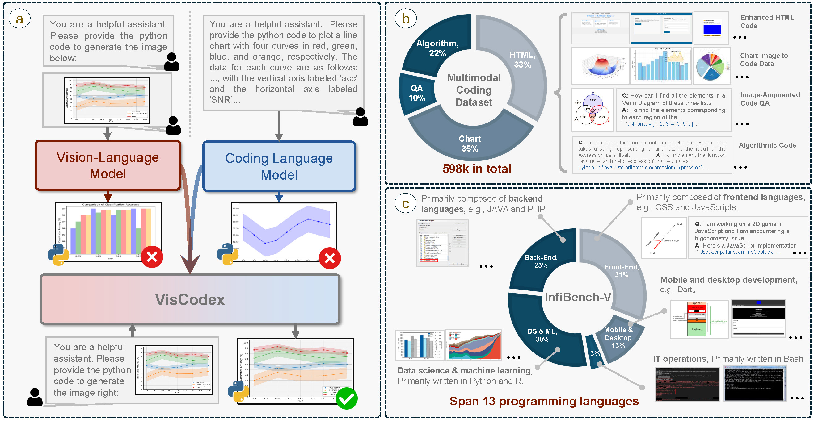
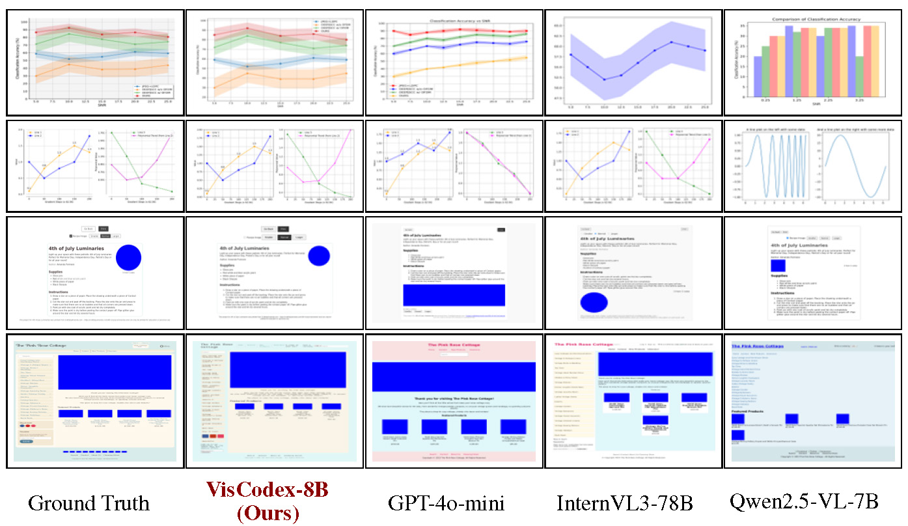

# VisCodex: Unified Multimodal Code Generation via Merging Vision and Coding Models

[🤗 Multimodal Coding Dataset (MCD)](https://huggingface.co/datasets/lingjie23/MultimodalCodingDataset)

This repository contains the codes and data for the paper **"VisCodex: Unified Multimodal Code Generation via Merging Vision and Coding Models"**.  
The **code** will be released soon — please stay tuned.  
The **MCD dataset**, developed for our research, is now available on [🤗 Multimodal Coding Dataset (MCD)](https://huggingface.co/datasets/lingjie23/MultimodalCodingDataset).

---

## 📌 Overview
VisCodex is a unified multimodal framework that merges **vision-language models** with **code-specialized LLMs** using a **task vector-based model merging** strategy.  
It brings **state-of-the-art multimodal code generation** capabilities, enabling models to understand complex visual contexts and produce **syntactically correct, functionally accurate code**.

<p align="center">
  
</p>

*Figure 1: Illustration of the VisCodex pipeline. (a) Model merging strategy for unifying vision-language and coding LLMs; (b) Data distribution and representative cases of MCD; (c) Category breakdown and representative cases of InfiBench-V.*

---

## 📊 Main Results
<p align="center">
  
</p>

---

## 💡 Case Study
<p align="center">
  
</p>
Example qualitative comparisons on multimodal coding tasks.

---

## 📬 Contact
For any questions, please contact:  
- **Lingjie Jiang**: [lingjiejiang@stu.pku.edu.cn](mailto:lingjiejiang@stu.pku.edu.cn)

## 📜 Citation
If you use our dataset, benchmark, or method in your research, please cite:


```bibtex
@article{jiang2025viscodex,
  title={VisCodex: Unified Multimodal Code Generation via Merging Vision and Coding Models},
  author={Lingjie Jiang and Shaohan Huang and Xun Wu and Yixia Li and Dongdong Zhang and Furu Wei},
  journal={arXiv preprint arXiv:XXXX.XXXXX},
  year={2025}
}
